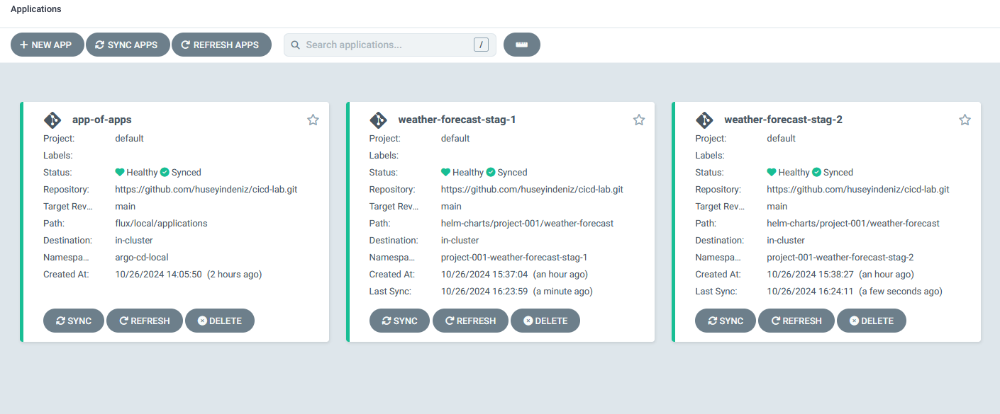
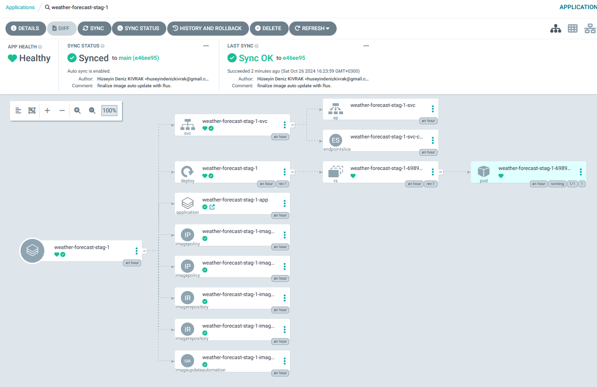
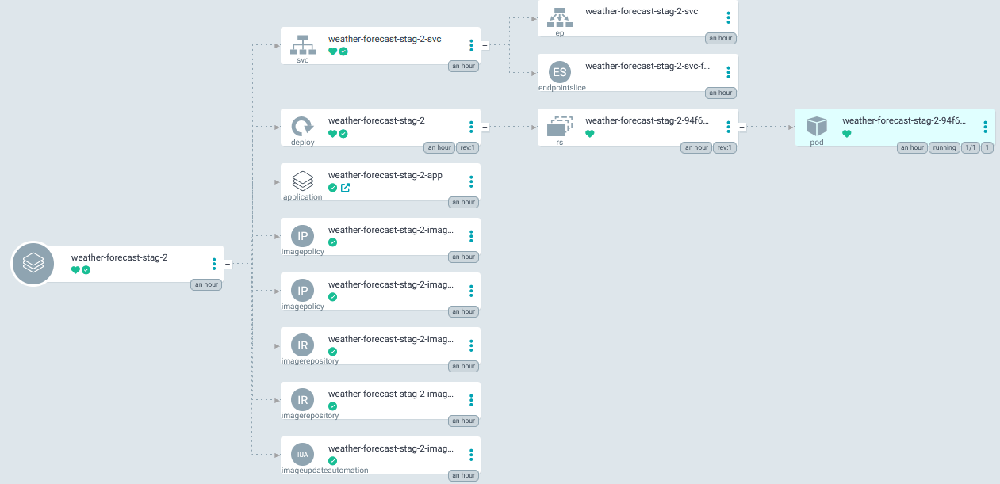
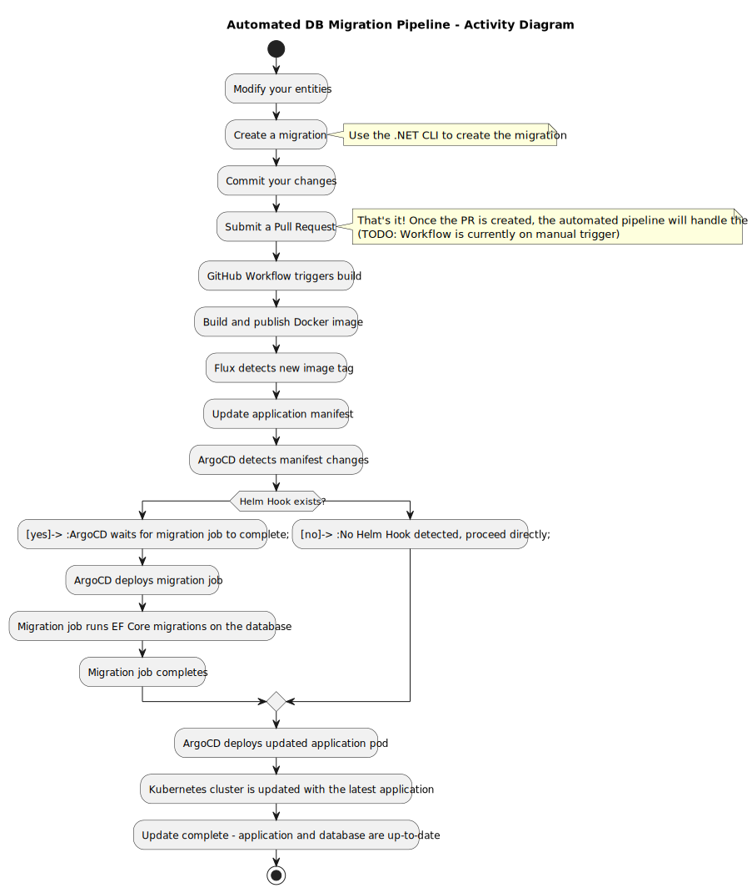

# gitops-lab

GitOps Playground (K8S, Terraform, Argo CD, Helm, Github Workflows etc.)

**Warning**: Latest db migration with 5m records testing on stag-2 is crashing whole cluster :D I'll investigate later.

## Goals

The primary objective of this repository is to build a robust GitOps playground, integrating tools and platforms like Kubernetes, Terraform, Argo CD, Helm, and GitHub Workflows. This environment will support a wide array of operational goals, including:

- **Establishing a Manageable Database Migration Infrastructure in the Cloud**:
  Implement an effective GitOps-based strategy for database migrations using EF Core, supporting seamless migrations and schema management across multiple cloud environments.
- **Deploying and Configuring Core Infrastructure Components**:
  Set up Kubernetes clusters on AWS, AKS, GKE, and DOKS, with necessary networking (VPC) and cluster resources for multi-cloud testing and management.
- **Automating Deployment and Updates through GitOps**:
  Utilize Argo CD, Flux, and GitHub Actions to achieve automated, continuous deployments, including version-controlled database changes and application updates.
- **Implementing Advanced Deployment Strategies**:
  Configure canary and blue/green deployments for production environments, ensuring safe and controlled application rollouts.
- **Ensuring Robust Rollback and Conflict Management**:
  Define rollback mechanisms and scenarios for managing conflicting and large database migrations to ensure application reliability.
- **Setting Up Multi-Environment Support**:
  Establish and manage staging, testing, and production environments for a sample application with tailored Helm charts and manifests.
- **Integrating Image Update Automation**:
  Configure image update automation tools, such as Argo CD Image Updater and Flux, to manage app deployments based on image tags.
- **Enhancing Observability and Monitoring**:
  Integrate monitoring solutions like Prometheus and Grafana for real-time performance tracking, alerting, and visualization across deployments.
- **Automating PR Deployment and Workflow Management**:
  Set up PR deployment automation via Slack for enhanced collaboration and streamlined deployment notifications.
- **Enabling AI/ML Pipeline Deployment**:
  Develop workflows and environments that support AI training and inference pipeline deployments, with GPU resources if applicable.
- **Conducting Load and Performance Testing**:
  Implement load testing mechanisms to ensure system resilience and performance under various load conditions.

## TODO

- ✅ Install/Configure minikube
- ✅ Install/Configure terraform
- ✅ Install/Configure helm
- ✅ Install/Configure argocd
- ✅ Create/Configure app of app in argocd
- ✅ Create/Configure application set manifest for sample app
- ✅ Create/Configure helm chart for a service in sample app
- ✅ Create/Configure github actions
- ✅ Configure multi stating env for a specific app
- ✅ Configure helm hook for db migration before application itself deployed
- ❌ Install/Configure argocd-image-updater ([it doesn't support app in any namespace scenario yet](https://github.com/argoproj-labs/argocd-image-updater/issues/601))
- ✅ Install/Configure flux for auto image updates
- 🔲 automate deployment of PRs via Slack
- 🔲 rollback scenario
- 🔲 conflicting migration scenario
- 🔲 huge and busy db migration scenario
- 🔲 gpu/ai training/inference pipeline scenario
- 🔲 monitoring (prometheus, grafana)
- 🔲 canary prod deployment setup
- 🔲 blue/green prod deployment setup
- 🔲 load test
- 🔲 aws (vpc and cluster creation is ready)
- 🔲 aks (vpc and cluster creation is ready)
- 🔲 gke (vpc and cluster creation is ready)
- 🔲 doks

## Note on Database Migrations in Kubernetes and EF Core Migration Bundles

While working through how to handle database migrations in Kubernetes, I found it to be more challenging than expected. The main issue is that migrations need to be completed before any application pods are re-deployed to keep the schema in sync. Since Kubernetes doesn't have a built-in way to enforce dependencies between deployments, it can be tricky to control the correct order of operations.

Initially, I explored using Argo CD hooks to solve this problem. However, I found that they don't fully address the dependency issue, as they don't enforce a strict sequence between running the migrations and updating the application pods. This could potentially lead to race conditions, where the application is deployed before the migrations finish.

Through further experimentation, I discovered that Helm hooks worked better for this scenario. Helm hooks allowed me to ensure that the migrations were applied before any application pods were deployed or updated. In essence, this moved the solution to the application layer within the Helm charts, helping me manage the order of operations effectively.

Additionally, I used Entity Framework (EF) Core Migration Bundles to make the process smoother. These bundles are self-contained executables that include all necessary migration logic, making it easier to apply migrations in any environment without needing the EF CLI tools or a full development setup. Combining EF Core migration bundles with Helm hooks felt like a natural fit within a GitOps workflow, providing a consistent and version-controlled way to apply schema changes alongside application updates.

This approach worked well for my case, ensuring that database migrations were correctly managed within the CI/CD pipeline and reducing deployment risks in Kubernetes environments. There may be other solutions out there, but this combination of Helm hooks and EF Core migration bundles was the one that solved the problem effectively for me.

ArgoCD Overview



ArgoCD App View



Migration Demo



## Developer Workflow

Follow these steps to update your application and database with minimal effort.

### Adding new migration

```bash
dotnet ef migrations add <MigrationName> --project ./mySampleApp1.weatherForecast.Infra --startup-project ./mySampleApp1.weatherForecast.API
```

### Automated DB Migration Pipeline Flow


