# gitops-lab

GitOps Playground (K8S, Terraform, Argo CD, Helm, Github Workflows etc.)

- [](https://github.com/huseyindeniz/gitops-lab/actions/workflows/mySampleApp1-UnitTests.yml)
- [](https://github.com/huseyindeniz/gitops-lab/actions/workflows/mySampleApp1-IntegrationTests.yml)
- [](https://github.com/huseyindeniz/gitops-lab/actions/workflows/mySampleApp1-FitnessTests.yml)
- [](https://github.com/huseyindeniz/gitops-lab/actions/workflows/mySampleApp1-BATests.yml)

## Repository Structure

| **dir name**  |                                           |
| ------------- | ----------------------------------------- |
| apps          | Holds sample applications code            |
| flux          | holds argocd application manifests        |
| helm-charts   | holds various helm charts                 |
| host          | holds applications run on my host machine |
| raw-manifests | holds various k8s resources               |
| scripts       | holds various scripts                     |
| terraform     | holds terraform files                     |

TODO: add more explanation here.

## Local Clusters

| **TODO**                    | local-management | local-staging  | local-production            | host           |
| --------------------------- | ---------------- | -------------- | --------------------------- | -------------- |
| runs on                     | wsl 2 ubuntu     | wsl 2 ubuntu   | wsl 2 ubuntu                | windows docker |
| Minikube                    | ✅               | ✅             | ✅                          | -              |
| Terraform                   | ✅               | ✅             | ✅                          | -              |
| Helm                        | ✅               | ✅             | ✅                          | -              |
| reverse-proxy               | -                | -              | -                           | ✅             |
| grafana                     | -                | -              | -                           | ✅             |
| environments                | -                | stag-1, stag-2 | prod-bluegreen, prod-canary | -              |
| Cert Manager                | ✅               | ✅             | ✅                          | -              |
| Istio                       | ✅               | ✅             | ✅                          | -              |
| MetalLB                     | ✅               | ✅             | ✅                          | -              |
| K8SDashboard                | ✅               | ✅             | ✅                          | -              |
| ArgoCD                      | ✅               | -              | -                           | -              |
| Argo Rollouts               | -                | -              | ✅                          | -              |
| Argo Workflows              | -                | ✅             | -                           | -              |
| Flux                        | ✅               | -              | -                           | -              |
| ARC Runners                 | -                | ✅             | ✅                          | -              |
| Harbor                      | -                | ✅             | -                           | -              |
| minIO                       | -                | ✅             | -                           | -              |
| Prometheus                  | -                | ✅             | ✅                          | -              |
| Loki                        | -                | ✅             | ✅                          | -              |
| Tempo                       | -                | ✅             | ✅                          | -              |
| Vault(hashicorp)            | -                | 🔲             | 🔲                          | -              |
| Velero                      | -                | 🔲             | 🔲                          | -              |
| NVidia Triton               | -                | ✅             | -                           | -              |
| Sample Dotnet App           | -                | ✅             | ✅                          | -              |
| Sample Multiplayer Game App | -                | ✅             | -                           | -              |
| Sample AI Inference App     | -                | ✅             | -                           | -              |
| Ollama                      | -                | ✅             | -                           | -              |
| Sample AI Agent             | -                | 🔲             | -                           | -              |

## Cloud Clusters

| **TODO**             | EKS      | AKS     | GKE         | DOKS     |
| -------------------- | -------- | ------- | ----------- | -------- |
| CLI                  | ✅ (aws) | ✅ (az) | ✅ (gcloud) | 🔲 doctl |
| VPC                  | ✅       | ✅      | ✅          | 🔲       |
| Cluster              | ✅       | ✅      | ✅          | 🔲       |
| Istio                | 🔲       | 🔲      | 🔲          | 🔲       |
| K8SDashboard         | 🔲       | 🔲      | 🔲          | 🔲       |
| ArgoCD               | -        | -       | -           | 🔲       |
| Multiplayer Game App | -        | -       | -           | 🔲       |
| AI Agent             | -        | -       | -           | 🔲       |

## Helm Charts

| **TODO**                       |     |
| ------------------------------ | --- |
| Generic dotnet core webapi app | ✅  |
| Generic static website (nginx) | ✅  |
| Generic nodejs app             | ✅  |
| Generic python/flask app       | ✅  |
| GPU test app                   | ✅  |
| sample-game                    | ✅  |
| sample-ai                      | ✅  |

## Terraform Modules

| **TODO**                |     |
| ----------------------- | --- |
| arc-runners             | ✅  |
| argocd                  | ✅  |
| argo-rollouts           | ✅  |
| argo-workflows          | ✅  |
| cert-manager            | ✅  |
| cloudnative-pg-operator | ✅  |
| flux                    | ✅  |
| istio                   | ✅  |
| metalLB                 | ✅  |
| minio-operator          | ✅  |
| postgresql              | ✅  |
| redis                   | ✅  |
| redis-operator          | ✅  |

## Goals

### Automate and Manage Infrastructure

- ✅ Install Argo CD (on local-cluster)
- ❌ Argo CD Image Updater ([awaiting namespace support](https://github.com/argoproj-labs/argocd-image-updater/issues/601))
  - ✅ Install Flux for automated image updates (on local-cluster)
- ✅ Install Argo Rollouts (on local-cluster)
- ✅ Install Argo Workflows (on local-cluster)
- ✅ Create/Configure **app of apps/root app** for applications in Argo CD
- ✅ Create/Configure **app of apps/root app** for workflow templates in Argo CD
- ✅ Create/Configure **app of apps/root app** for wsl applications in Argo CD
- ✅ Create/Configure application set manifest for a sample app
- ✅ Create/Configure a generic .NET app Helm chart and use it for a service in the sample app
- ✅ Configure multi-staging environments usable by all apps
- ✅ Create/Configure Github Arc Runners

### Build a Comprehensive CI/CD Pipeline

- ✅ Manage application deployments via Argo CD and Helm
- ✅ Automate database migrations with Argo hooks
- 🔲 Define and implement rollback mechanisms
- 🔲 Address and test conflicting database migration scenarios
- ❌ Configure Argo Workflows for orchestrating CI/CD pipeline (it seems arc runners will be enough)
- **Use GitHub Workflows for CI tasks**

  - ✅ Unit Tests (on github runners)
  - ✅ Integration Tests (on github runners)
  - ✅ Fitness Tests (on github runners)
  - ✅ BA Tests (on arc runners)

- ✅ Create a Staging CI/CD Pipeline
- 🔲 Create a Production CI/CD Pipeline

### Enhanced Observability

- ✅ Monitoring with Prometheus and Grafana

### Advanced Deployment Strategies

- ✅ Canary production deployment setup
- ✅ Blue/Green production deployment setup

### Load Testing

- ✅ Perform load testing for performance validation

### Gaming

- ✅ Install Colyseus Server on the Kubernetes cluster to manage and deploy multiplayer game servers.
- ✅ Deploy a Phaser 3 game that uses the Colyseus client to interact with the Colyseus server for proper testing and demonstration of multiplayer functionality.

### AI/ML Support

- ✅ GPU support for AI/ML training and inference pipelines
- 🔲 Create a sample AI/ML application that demonstrates both training and inference pipelines using GPU support. (use/integrate https://github.com/xuebinqin/DIS )
  - ✅ inference
  - 🔲 Install and configure a local Docker image registry (Harbor) to manage and store large Docker images efficiently.
  - 🔲 training

### Blockchain

- 🔲 Deploy a stateful Avalanche Node on the cloud using Kubernetes StatefulSets.
- 🔲 Deploy a stable Avalanche CLI environment on the cloud, accessible via SSH for managing Avalanche Subnets and network operations.

## Demonstrations and Scenarios

### ArgoCD Overview


### ArgoCD App View


### Database Migration Demo


### Long Running DB Migration Job

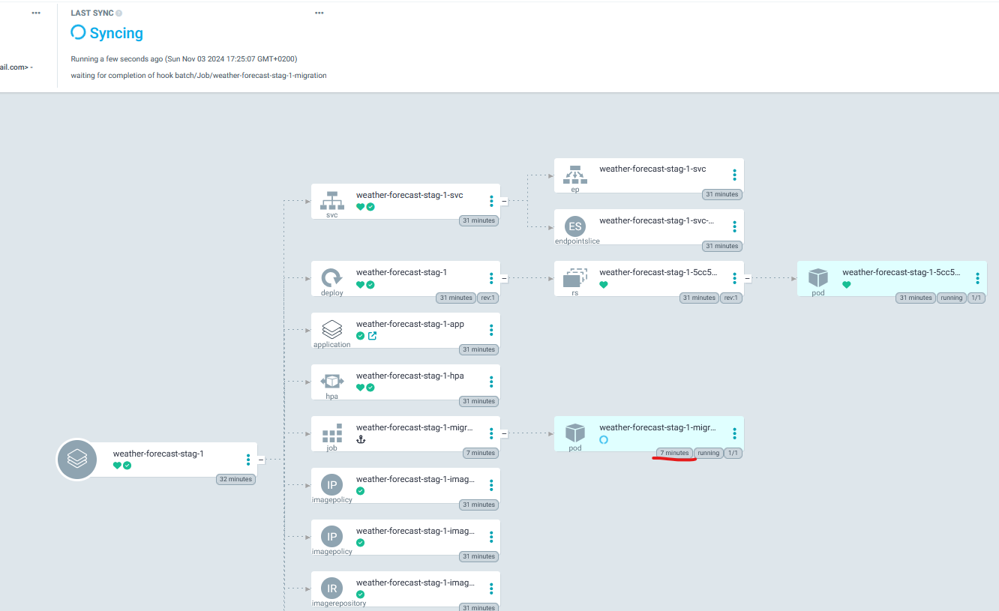

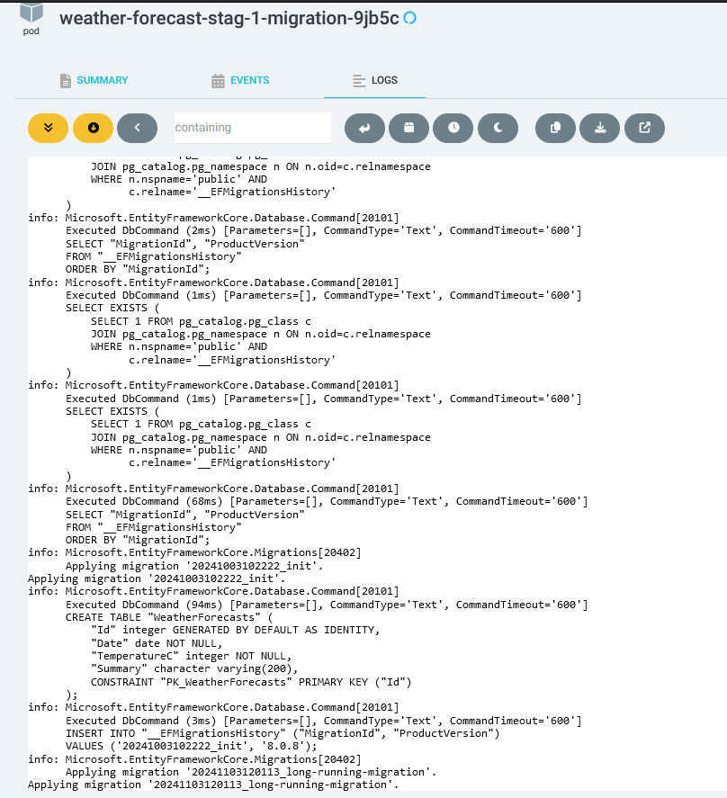

### Blue-Green Deployment

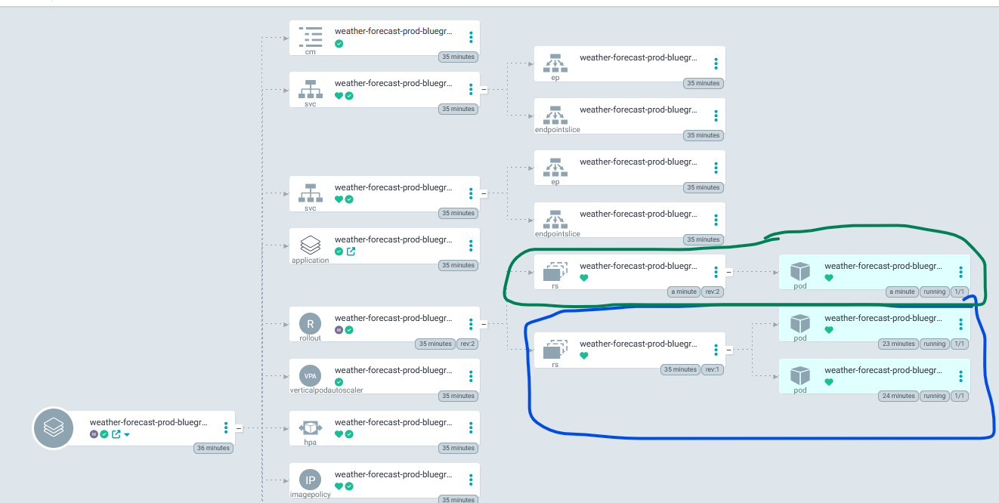

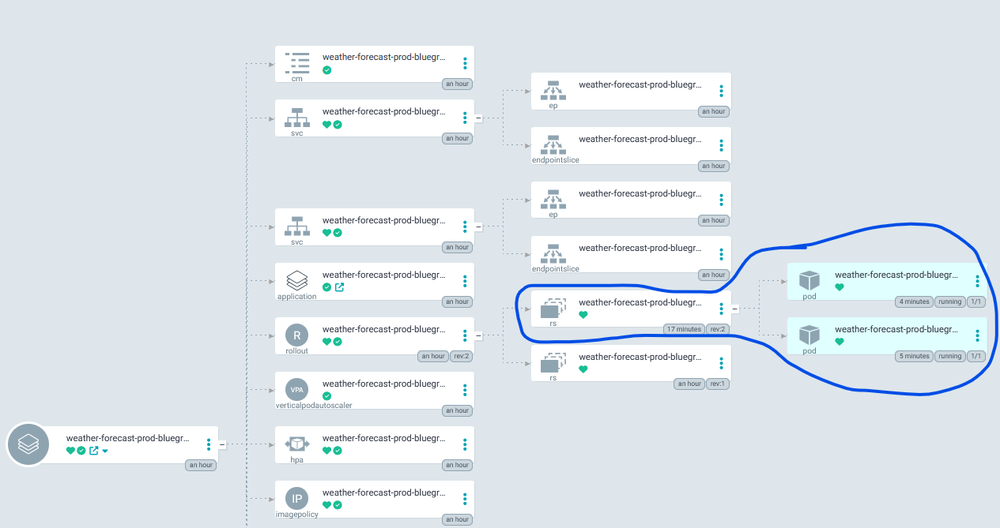

### Canary Deployment

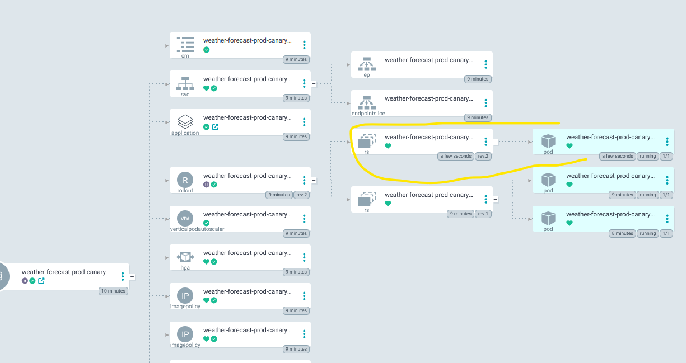


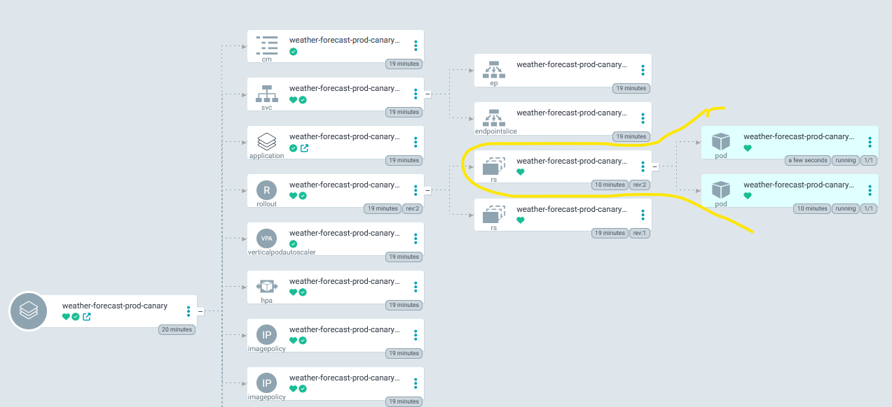

### Arc Runners

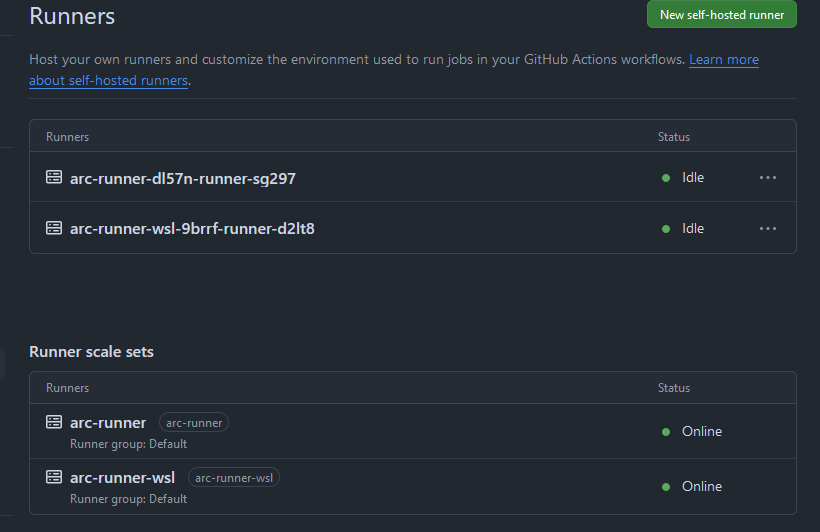

### Hello Argo Workflows

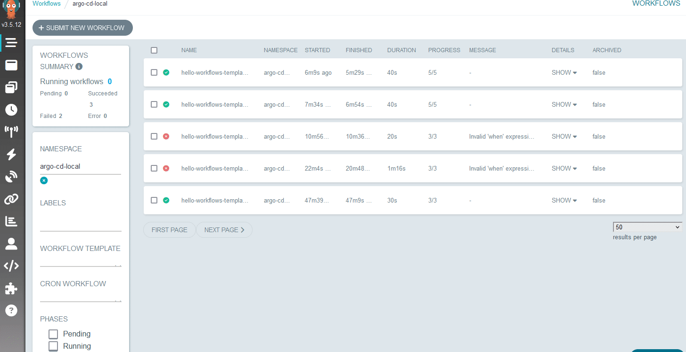

### GPU Support


### Monitoring with Prometheus and Grafana

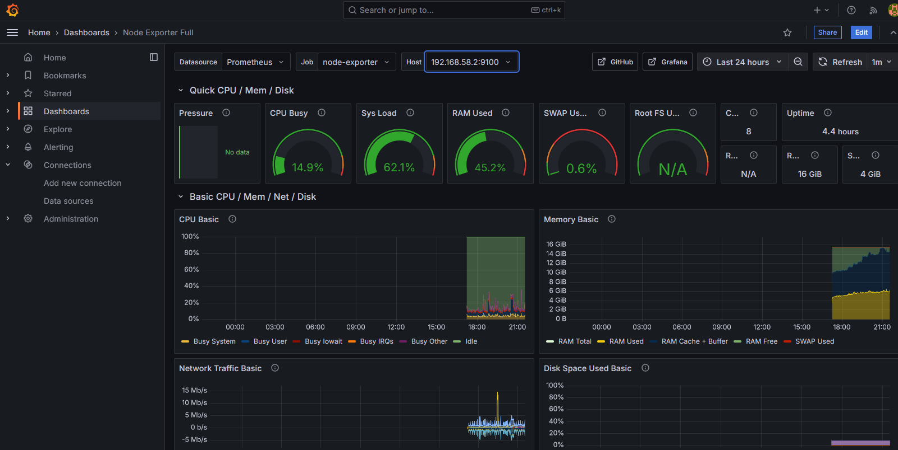

### Multiplayer (pVp) Game (Colysues + Phaser)

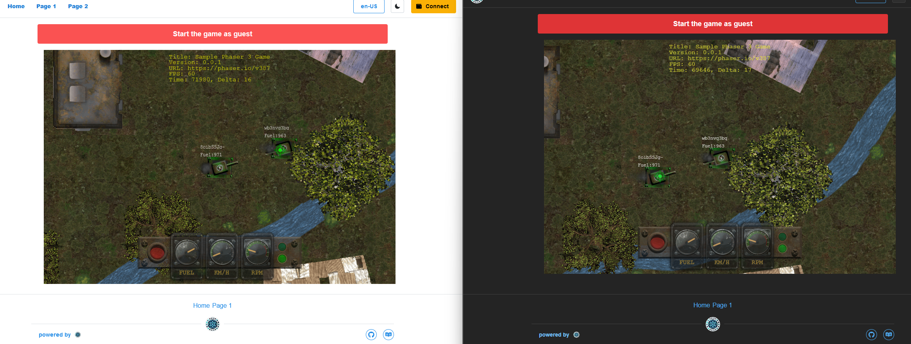

### Sample AI/ML App (pytorch - on GPU)

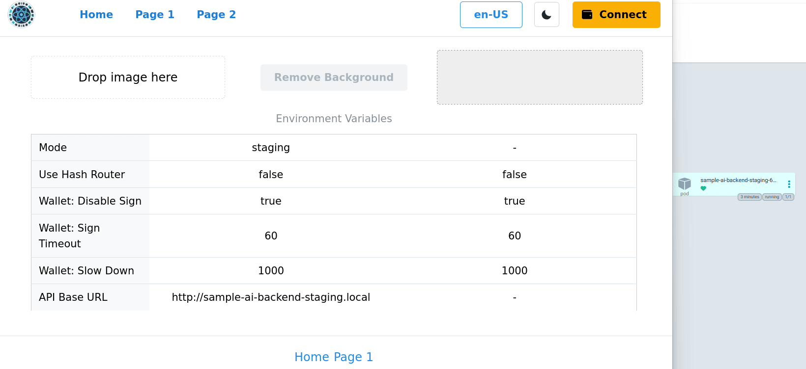

### Harbor

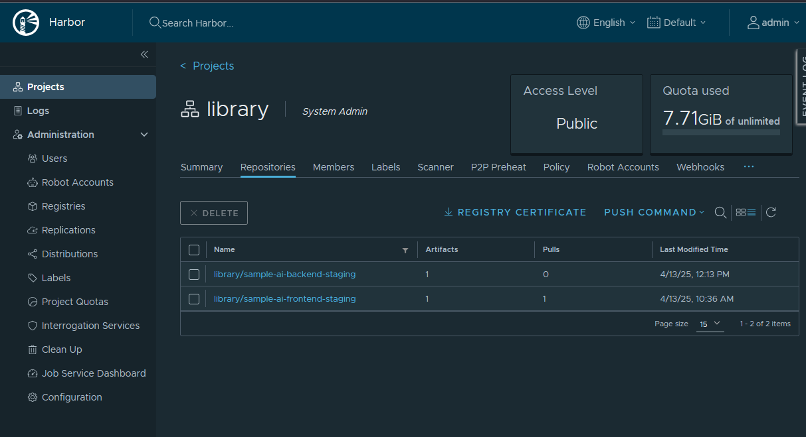

### MinIO

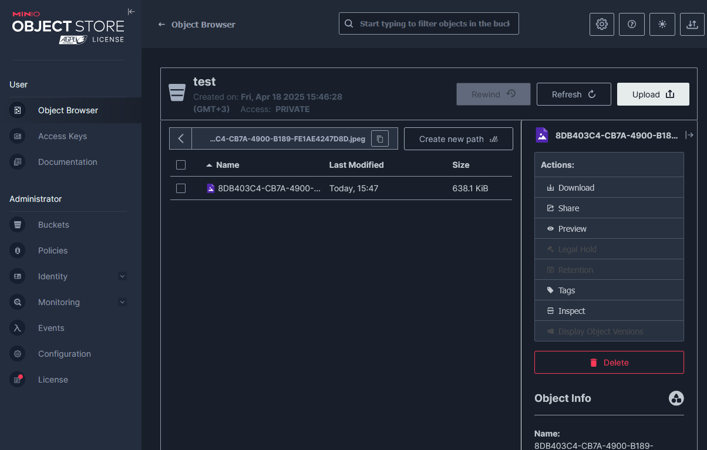

## Developer Workflow

Follow these steps to update your application and database with minimal effort.

### Adding new migration

```bash
dotnet ef migrations add <MigrationName> --project ./mySampleApp1.weatherForecast.Infra --startup-project ./mySampleApp1.weatherForecast.API
```

### Automated DB Migration Pipeline Flow


### Note on Database Migrations in Kubernetes

Handling database migrations in Kubernetes was initially challenging due to the lack of built-in mechanisms to enforce dependency order between deployments. To address this, I now use **Argo CD hooks** to run migrations before application pods are updated, ensuring the database schema is always in sync with the application.

While the solution works effectively, some limitations remain. For example, migrations are triggered with every resource update in the application, which can be time-consuming due to the need to rebuild the solution for each run. Despite this, the process is idempotent, ensuring database integrity without causing conflicts.

A potential improvement would be for EF Core migration bundles to support targeting specific migrations without requiring a full build. This would streamline the process and reduce delays, making it a valuable feature for future updates.

## More Info

- [Intro](https://github.com/huseyindeniz/gitops-lab/wiki)
- [Kubernetes notes](https://github.com/huseyindeniz/gitops-lab/wiki/Kubernetes)
- [Minikube notes](https://github.com/huseyindeniz/gitops-lab/wiki/Minikube)
- [Terraform notes](https://github.com/huseyindeniz/gitops-lab/wiki/Terraform)
- [Helm notes](https://github.com/huseyindeniz/gitops-lab/wiki/Helm)
- [Argo CD notes](https://github.com/huseyindeniz/gitops-lab/wiki/Argo-CD)
- [Argo Rollouts notes](https://github.com/huseyindeniz/gitops-lab/wiki/Argo-Rollouts)
- [Argo Workflows notes](https://github.com/huseyindeniz/gitops-lab/wiki/Argo-Workflows)
- [Github Actions notes](https://github.com/huseyindeniz/gitops-lab/wiki/Github-Actions)
- [Flux notes](https://github.com/huseyindeniz/gitops-lab/wiki/Flux)
- [Local env setup notes](https://github.com/huseyindeniz/gitops-lab/wiki/Local-Env)
- [AKS setup notes](https://github.com/huseyindeniz/gitops-lab/wiki/AKS)
- [EKS setup notes](https://github.com/huseyindeniz/gitops-lab/wiki/EKS)
- [GKE setup notes](https://github.com/huseyindeniz/gitops-lab/wiki/GKE)
- [DOKS setup notes](https://github.com/huseyindeniz/gitops-lab/wiki/DOKS)
- [Monitoring notes](https://github.com/huseyindeniz/gitops-lab/wiki/Monitoring)
- [Infra testing notes](https://github.com/huseyindeniz/gitops-lab/wiki/Infra-Testing)
- [DAPR notes](https://github.com/huseyindeniz/gitops-lab/wiki/DAPR)
- [DDD + EF Core Code First notes](https://github.com/huseyindeniz/gitops-lab/wiki/DDD-with-ef-core)
- [BDD notes](https://github.com/huseyindeniz/gitops-lab/wiki/BDD)
- [AI/ML Workloads notes](https://github.com/huseyindeniz/gitops-lab/wiki/AI-ML-Workloads)
- [Blockchain notes](https://github.com/huseyindeniz/gitops-lab/wiki/Blockchain)
- [Colyseus notes](https://github.com/huseyindeniz/gitops-lab/wiki/Colyseus)
