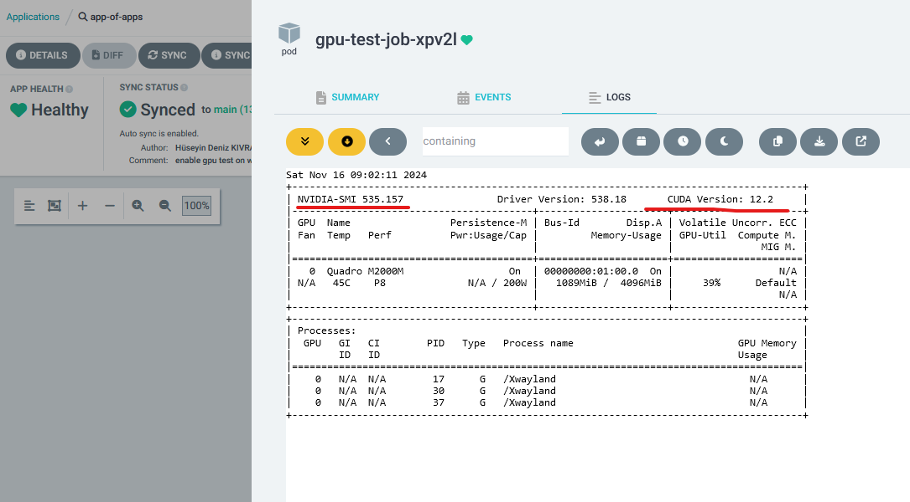

# gitops-lab

GitOps Playground (K8S, Terraform, Argo CD, Helm, Github Workflows etc.)

- [](https://github.com/huseyindeniz/gitops-lab/actions/workflows/mySampleApp1-UnitTests.yml)
- [](https://github.com/huseyindeniz/gitops-lab/actions/workflows/mySampleApp1-IntegrationTests.yml)
- [](https://github.com/huseyindeniz/gitops-lab/actions/workflows/mySampleApp1-BA-tests.yml)

## Goals

- **Automate and Manage Infrastructure**:  
  Leverage GitOps principles with Argo CD, Terraform, Helm, and Flux for:

  - Consistent and version-controlled infrastructure management
  - Automated image updates

- **Build a Stable CI/CD Pipeline**:  
  Create a robust pipeline with:

  - Multi-staging environments and production rollouts (blue-green and canary) using Argo Rollouts and Helm
  - Automated database migrations and easy rollback mechanisms
  - Support for GPU-based workloads and AI/ML pipelines
  - Multi-cloud deployments (AKS, EKS, GKE, DOKS) with Terraform and Kubernetes manifests

- **Enhanced Observability**:  
  Monitor deployments and performance with Prometheus and Grafana.

- **Load Testing**:  
  Validate system resilience and scalability under heavy traffic.

## Tools

| **Tool Name**      | **Classification**            | **Use Case**                                                                               |
| ------------------ | ----------------------------- | ------------------------------------------------------------------------------------------ |
| **Argo CD**        | Kubernetes Operator (GitOps)  | Synchronizes Kubernetes applications with Git repositories (declarative deployment)        |
| **Terraform**      | Infrastructure as Code (IaC)  | Manages Kubernetes resources and cloud infrastructure (provisioning, lifecycle management) |
| **Argo Rollouts**  | Deployment Strategies         | Manages advanced deployment strategies (e.g., canary, blue-green) in Kubernetes            |
| **Flux**           | Continuous Deployment         | Automates container image tag updates in Git repositories                                  |
| **Helm**           | Application Packaging         | Manages Kubernetes applications with packaged charts (configurable, reusable deployments)  |
| **GitHub Actions** | CI/CD Pipelines (Build, Test) | Automates CI workflows for unit tests, integration tests, PR policies, etc.                |
| **Argo Workflows** | CI/CD Pipeline Orchestration  | Orchestrates and manages multi-step, complex workflows across CI/CD pipelines              |

## TODO

### Install and Configure Tools

- ✅ Minikube (windows and wsl)
- ✅ Terraform (windows and wsl)
- ✅ Helm (windows and wsl)
- ✅ aws CLI (on windows)
- ✅ az CLI (on windows)
- ✅ gcloud CLI (on windows)
- 🔲 doctl CLI (on windows)

- **Cluster Setup**:

  - ✅ Create local-cluster via windows minikube
  - ✅ Create wsl-cluster via wsl minikube
  - ✅ Configure aws CLI in `kubectl` profiles
  - ✅ Configure az CLI in `kubectl` profiles
  - ✅ Configure gcloud CLI in `kubectl` profiles
  - 🔲 Configure doctl CLI in `kubectl` profiles
  - ✅ Create EKS cluster (VPC and cluster creation via Terraform)
  - ✅ Create AKS cluster (VPC and cluster creation via Terraform)
  - ✅ Create GKE cluster (VPC and cluster creation via Terraform)
  - 🔲 Create DOKS cluster (VPC and cluster creation via Terraform)
  - ✅ Add wsl-cluster to ArgoCD
  - 🔲 Install Argo CD on DOKS (Remote ArgoCD)
  - 🔲 Add AKS cluster to Remote ArgoCD
  - 🔲 Add EKS cluster to Remote ArgoCD
  - 🔲 Add GKE cluster to Remote ArgoCD

### Automate and Manage Infrastructure

- ✅ Install Argo CD (on local-cluster)
- ❌ Argo CD Image Updater ([awaiting namespace support](https://github.com/argoproj-labs/argocd-image-updater/issues/601))
  - ✅ Install Flux for automated image updates (on local-cluster)
- ✅ Install Argo Rollouts (on local-cluster)
- ✅ Install Argo Workflows (on local-cluster)
- ✅ Create/Configure **app of apps/root app** for applications in Argo CD
- ✅ Create/Configure **app of apps/root app** for workflow templates in Argo CD
- ✅ Create/Configure **app of apps/root app** for wsl applications in Argo CD
- ✅ Create/Configure application set manifest for a sample app
- ✅ Create/Configure a generic .NET app Helm chart and use it for a service in the sample app
- ✅ Configure multi-staging environments usable by all apps
- ✅ Create/Configure Github Arc Runners

### Build a Comprehensive CI/CD Pipeline

- ✅ Manage application deployments via Argo CD and Helm
- ✅ Automate database migrations with Argo hooks
- 🔲 Define and implement rollback mechanisms
- 🔲 Address and test conflicting database migration scenarios
- ❌ Configure Argo Workflows for orchestrating CI/CD pipeline (it seems arc runners will be enough)
- **Use GitHub Workflows for CI tasks**

  - ✅ Unit Tests (on github runners)
  - ✅ Integration Tests (on github runners)
  - 🔲 Fitness Tests (on github runners)
  - ✅ BA Tests (on arc runners)

- 🔲 Create a Staging CI/CD Pipeline
- 🔲 Create a Production CI/CD Pipeline

### Enhanced Observability

- ✅ Monitoring with Prometheus and Grafana

### Advanced Deployment Strategies

- ✅ Canary production deployment setup
- ✅ Blue/Green production deployment setup

### Load Testing

- ✅ Perform load testing for performance validation

### AI/ML Support

- ✅ GPU support for AI/ML training and inference pipelines
- 🔲 Include a sample AI/ML application that demonstrates both training and inference pipelines using GPU support.

### Blockchain

- 🔲 Deploy a stateful Avalanche Node on the cloud using Kubernetes StatefulSets.
- 🔲 Deploy a stable Avalanche CLI environment on the cloud, accessible via SSH for managing Avalanche Subnets and network operations.

### Gaming

- 🔲 Install Colyseus Server on the Kubernetes cluster to manage and deploy multiplayer game servers.
- 🔲 Deploy a Phaser 3 game that uses the Colyseus client to interact with the Colyseus server for proper testing and demonstration of multiplayer functionality.

## Demonstrations and Scenarios

### ArgoCD Overview


### ArgoCD App View


### Database Migration Demo


### Long Running DB Migration Job


### Blue-Green Deployment


### Canary Deployment


### Hello Argo Workflows


### GPU Support



### Monitoring with Prometheus and Grafana


## Developer Workflow

Follow these steps to update your application and database with minimal effort.

### Adding new migration

```bash
dotnet ef migrations add <MigrationName> --project ./mySampleApp1.weatherForecast.Infra --startup-project ./mySampleApp1.weatherForecast.API
```

### Automated DB Migration Pipeline Flow


### Note on Database Migrations in Kubernetes

Handling database migrations in Kubernetes was initially challenging due to the lack of built-in mechanisms to enforce dependency order between deployments. To address this, I now use **Argo CD hooks** to run migrations before application pods are updated, ensuring the database schema is always in sync with the application.

While the solution works effectively, some limitations remain. For example, migrations are triggered with every resource update in the application, which can be time-consuming due to the need to rebuild the solution for each run. Despite this, the process is idempotent, ensuring database integrity without causing conflicts.

A potential improvement would be for EF Core migration bundles to support targeting specific migrations without requiring a full build. This would streamline the process and reduce delays, making it a valuable feature for future updates.

## More Info

- [Intro](https://github.com/huseyindeniz/gitops-lab/wiki)
- [Kubernetes notes](https://github.com/huseyindeniz/gitops-lab/wiki/Kubernetes)
- [Minikube notes](https://github.com/huseyindeniz/gitops-lab/wiki/Minikube)
- [Terraform notes](https://github.com/huseyindeniz/gitops-lab/wiki/Terraform)
- [Helm notes](https://github.com/huseyindeniz/gitops-lab/wiki/Helm)
- [Argo CD notes](https://github.com/huseyindeniz/gitops-lab/wiki/Argo-CD)
- [Argo Rollouts notes](https://github.com/huseyindeniz/gitops-lab/wiki/Argo-Rollouts)
- [Argo Workflows notes](https://github.com/huseyindeniz/gitops-lab/wiki/Argo-Workflows)
- [Github Actions notes](https://github.com/huseyindeniz/gitops-lab/wiki/Github-Actions)
- [Flux notes](https://github.com/huseyindeniz/gitops-lab/wiki/Flux)
- [Local env setup notes](https://github.com/huseyindeniz/gitops-lab/wiki/Local-Env)
- [AKS setup notes](https://github.com/huseyindeniz/gitops-lab/wiki/AKS)
- [EKS setup notes](https://github.com/huseyindeniz/gitops-lab/wiki/EKS)
- [GKE setup notes](https://github.com/huseyindeniz/gitops-lab/wiki/GKE)
- [DOKS setup notes](https://github.com/huseyindeniz/gitops-lab/wiki/DOKS)
- [Monitoring notes](https://github.com/huseyindeniz/gitops-lab/wiki/Monitoring)
- [Infra testing notes](https://github.com/huseyindeniz/gitops-lab/wiki/Infra-Testing)
- [DAPR notes](https://github.com/huseyindeniz/gitops-lab/wiki/DAPR)
- [DDD + EF Core Code First notes](https://github.com/huseyindeniz/gitops-lab/wiki/DDD-with-ef-core)
- [BDD notes](https://github.com/huseyindeniz/gitops-lab/wiki/BDD)
- [AI/ML Workloads notes](https://github.com/huseyindeniz/gitops-lab/wiki/AI-ML-Workloads)
- [Blockchain notes](https://github.com/huseyindeniz/gitops-lab/wiki/Blockchain)
- [Colyseus notes](https://github.com/huseyindeniz/gitops-lab/wiki/Colyseus)
