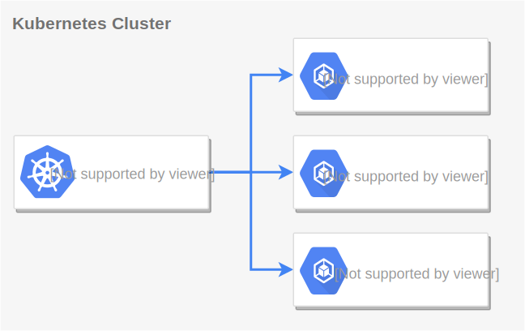
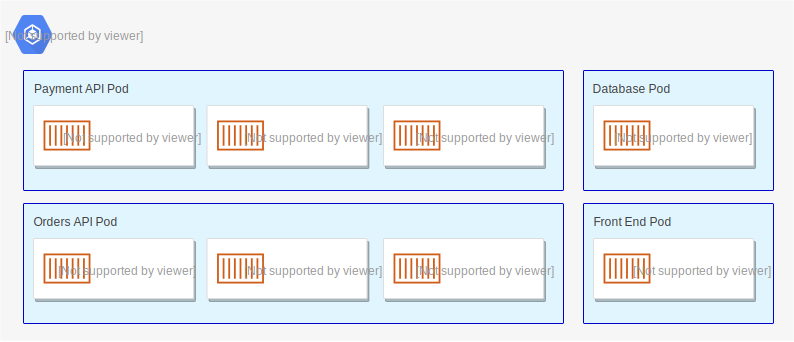
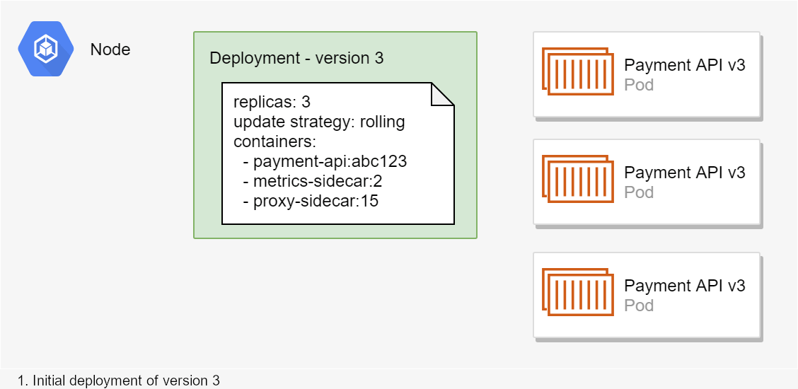
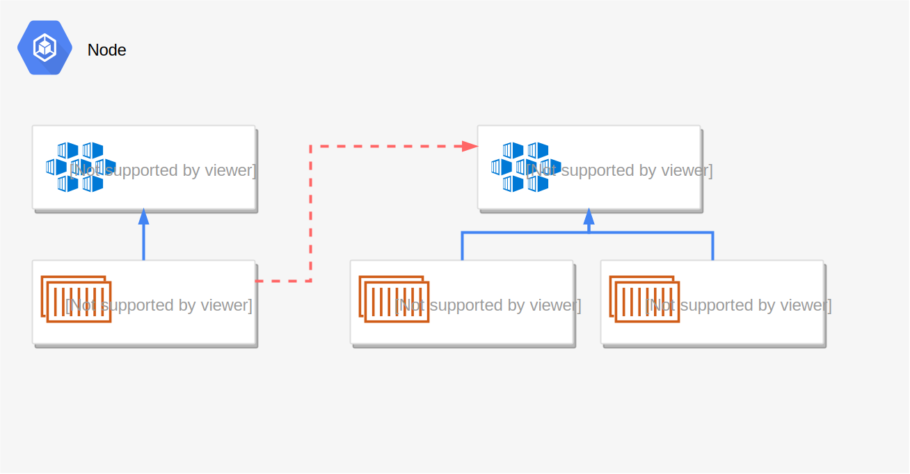
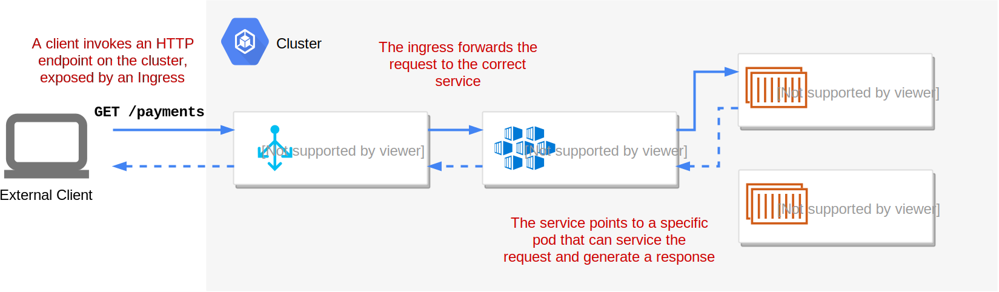

# k8s notes

## What is Kubernetes

Kubernetes is an open-source platform for orchestrating containers (typically Docker containers). It manages the lifecycle and networking of containers that are scheduled to run.

The basic Kubernetes components for developers

## Nodes

Nodes in a Kubernetes cluster are Virtual Machines or physical hardware. It's where Kubernetes actually runs your containers. There are typically 2 types of Node

- **The master node**: Contains all the "control plane" services required to run a cluster. Typically the master node only handles this management access, and doesn't run any of your containerised app workloads.
- **Worker nodes**: These are used to run your applications. which are used to run your applications. A single node can run many containers, depending on the resource constraints (memory, CPU etc) of the node



**Additional Details**

- **Kubelet**: Each node runs a Kubelet, which is an agent that ensures the containers described in PodSpecs are running and healthy.
- **Taints and Tolerations**: These are used to control which Pods can be scheduled on a node. Taints apply to nodes, and tolerations apply to Pods, helping to ensure Pods are only scheduled on appropriate nodes.

## Pods

To run your application in Kubernetes, you package it into a container (typically a Docker container) and ask Kubernetes to run it. A pod is the smallest unit that you can ask Kubernetes to run. It contains one or more containers. When a pod is deployed or killed, all of the containers inside it are started or killed together.

What is relatively common is having "supporting" containers deployed alongside the "main" container in a pod, using the sidecar pattern. These sidecar containers handle cross-cutting concerns for the main application. For example, they might act like a proxy and handle authentication for the main app, handle service discovery and service-mesh behaviours, or act as a sink for application performance monitoring.



Pods are a collection of containers that Kubernetes schedules as a single unit. Initially your pods will likely contain a single container, one for each API or app you're deploying.

**Additional Details**

- **Pod Lifecycle**: A Pod’s lifecycle starts from Pending and can go through several phases, including Running, Succeeded, and Failed. Understanding these phases is crucial for debugging and managing applications.
- **Init Containers**: These are special containers that run before app containers in a pod. They can be used to set up some preconditions before your main application containers start.

## Deployments

k8s orchestration is primarily about two things:

- Managing the lifetime of containers
- Managing the communication between containers

Deployments in Kubernetes are related to the first of those points, managing the lifetime of containers. You can think of a deployment as a set of declarative statements about how to deploy a pod, and how Kubernetes should manage it.



Deployments are used to define how Pods are deployed, which Docker images they should use, how many replicas should be running, and so on. They represent the desired state for the cluster, which Kubernetes works to maintain.

**Additional Details**

- **Rolling Updates**: Deployments allow for rolling updates, where new versions of the application can be gradually rolled out to avoid downtime. Kubernetes manages the process, ensuring that some Pods are always running during the update.
- **Rollbacks**: If a new deployment causes issues, Kubernetes can roll back to a previous version, ensuring the stability of your application.

## Services

A service acts as an internal load-balancer for the pods. Pods talk to other pods via services, instead of contacting them directly.



**Additional Details**

- **Types of Services**:
  - **ClusterIP**: The default type, which exposes the service on an internal IP in the cluster. This is only accessible within the cluster.
  - **NodePort**: Exposes the service on each node’s IP at a static port. Accessible from outside the cluster by `<NodeIP>:<NodePort>`.
  - **LoadBalancer**: Exposes the service externally using a cloud provider’s load balancer.
  - **ExternalName**: Maps the service to a DNS name by returning a CNAME record.
- **Selectors**: Services use selectors to match Pods with specific labels. This allows them to route traffic to the appropriate Pods.

## Ingresses

An Ingress exposes HTTP endpoints for a service that clients can call. HTTP requests to the endpoint are forwarded by the Ingress to the associated service on a node, which passes the request to the Pod.



**Additional Details**

- **Ingress Controller**: To actually implement the Ingress rules, you need an Ingress Controller, which is a specialized load balancer for managing Ingress resources.
- **Ingress vs Service**: While a Service typically operates at Layer 4 (TCP/UDP), an Ingress operates at Layer 7 (HTTP/HTTPS), providing more advanced routing capabilities.

## ConfigMaps and Secrets

**ConfigMaps**

ConfigMaps are used to store non-sensitive configuration data in key-value pairs. They can be consumed by Pods as environment variables, command-line arguments, or configuration files.

**Secrets**

Secrets are similar to ConfigMaps, but they are specifically designed to hold sensitive information like passwords, OAuth tokens, and SSH keys. They provide an extra layer of security by allowing you to store and manage sensitive information separately.

## Namespaces

Namespaces are a way to divide cluster resources between multiple users (via resource quotas). They are useful for isolating environments like development, staging, and production, or for separating the resources of different teams.

## Labels

Labels are key-value pairs attached to Kubernetes objects, such as Pods, Services, and Deployments. They are used to organize and categorize objects in the cluster. Labels are essential for managing resources and can be used to filter and select specific objects.

- **Example**: `app=nginx, environment=production, tier=frontend`
- **Use Cases**:
  - Distinguishing between environments (e.g., environment=staging vs. environment=production)
  - Tracking application versions (e.g., version=v1)
  - Categorizing components in multi-tier applications (e.g., tier=backend)

## Selectors

Selectors are queries used to filter Kubernetes objects based on their labels. They allow you to target specific subsets of objects that match the criteria defined by the labels.

- **Label Selector**: The most common type, used to match objects with specific labels.
  - Example: A Service might use the selector app=nginx to target all Pods with the label app=nginx.
- **Types of Selectors**:
  - **Equality-based**: Matches objects where the label key equals a specified value. Example: `app=nginx`
  - **Set-based**: Matches objects where the label key is in a set of values or not in a set. Example: `env in (staging, production)`

Selectors are crucial for Kubernetes components like Services, Deployments, and Jobs, as they define how these resources interact with the objects in the cluster.

## Jobs

A Job in Kubernetes is used to manage short-lived, one-off tasks that need to be executed to completion. Unlike Deployments, which are meant to run continuously, Jobs ensure that a specified number of Pods successfully complete their tasks and then terminate.

**Key Concepts**:

- **Single-Run Jobs**: Executes a task once or until successful completion.
- **Parallel Jobs**: Runs multiple Pods in parallel to complete a task faster or handle batch processing.

**Use Cases**:

- **Data Processing**: Handling tasks like data processing or database migrations that need to run to completion.
- **Batch Tasks**: Executing batch jobs that don’t need to run continuously.

## StatefulSets

Used for managing stateful applications. Unlike Deployments, StatefulSets maintain a sticky identity for each of their Pods and are used when you need to persist data across Pod restarts (e.g., databases).

## DaemonSets

Ensures that a copy of a Pod runs on all (or some) nodes in the cluster. Useful for running background tasks like log collection or monitoring.

## CronJobs

Similar to Jobs but scheduled to run at specified times or intervals. Ideal for periodic tasks like backups or report generation.

## Persistent Volumes (PVs) and Persistent Volume Claims (PVCs):

- **Persistent Volumes**: Provide storage that can be used by Pods, separate from the lifecycle of the Pods.
- **Persistent Volume Claims**: Requests for storage by a user, which can be fulfilled by a PV.

## RBAC (Role-Based Access Control)

A method for controlling access and permissions in a Kubernetes cluster. RBAC allows you to define what actions users and service accounts can perform.

## Network Policies

Used to control the network traffic between Pods, defining how Pods can communicate with each other and with other network endpoints.

## Commands

**Show namespaces**

```bash
kubectl get namespaces
```

**Show All Pods**

```bash
kubectl get pods --all-namespaces
```

**Show running pods in a namespace**

```bash
kubectl get pods -n {namespace}
```

**Describe a Pod**

```bash
kubectl describe pod {pod-name} -n {namespace}
```

**Show Services**

```bash
kubectl get services -n {namespace}
```

**Show Deployments**

```bash
kubectl get deployments -n {namespace}
```

**Show Jobs**

```bash
kubectl get jobs -n {namespace}
```

**Show StatefulSets**

```bash
kubectl get statefulsets -n {namespace}
```

**Show DaemonSets**

```bash
kubectl get daemonsets -n {namespace}
```

**Port forwarding**

```bash
kubectl port-forward {service-name} -n {namespace} {target-port}:{port}
```

**Get Logs from a Pod**

```bash
kubectl logs {pod-name} -n {namespace}
```

**Execute a Command in a Pod**

```bash
kubectl exec -it {pod-name} -n {namespace} -- {command}
```

**Apply Configuration**

```bash
kubectl apply -f {file.yaml}
```

**Delete a Resource**

```bash
kubectl delete -f {file.yaml}
```

**Get Resource Usage**

```bash
kubectl top pods -n {namespace}
```

**Get Resource Usage**

```bash
kubectl cluster-info
```

**Get Events**

```bash
kubectl get events -n {namespace}
```

```bash
kubectl get nodes
```

## Best Practices

- **Resource Requests and Limits**: Always define resource requests and limits for your Pods to ensure fair resource allocation and to prevent a single Pod from consuming all resources on a node.
- **Liveness and Readiness Probes**: Implement these probes to ensure that your application is running correctly and is ready to serve traffic.
- **Avoid Running as Root**: Configure your containers to run as a non-root user to minimize security risks.

## References

- [Deploying ASP.NET Core applications to Kubernetes - Part 1](https://andrewlock.net/deploying-asp-net-core-applications-to-kubernetes-part-1-an-introduction-to-kubernetes/)
